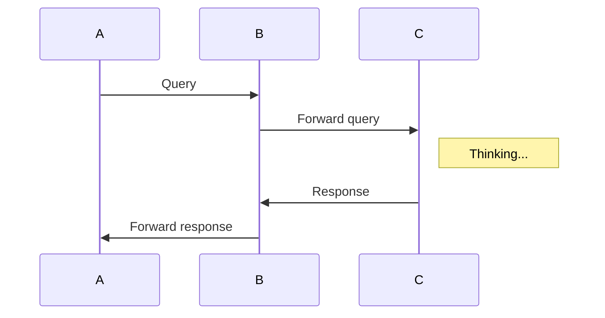

# sequence-diagrams
A simple chrome extension to add support for mermaid blocks in github pages

For example add this to any wiki page or markdown file in github



This will generate a nice diagram using the mermaid library

## Instructions to install it

### From the crx file

1. download the extension from https://github.com/Redisrupt/sequence-diagrams/blob/master/extension.crx?raw=true
2. navigate to `chrome://extensions` in your chrome browser
3. drag and drop the recently downloaded extension

### From source

1. Enable developer mode in chrome://extensions
2. Clone the repo
   ```bash
   git clone https://github.com/Redisrupt/sequence-diagrams
   ```
3. Click on load unpacked extension
4. Select the extensions folder inside the recently cloned repo

Done!

Navigate to any page in github with mermaid syntax blocks to see the extension in action

