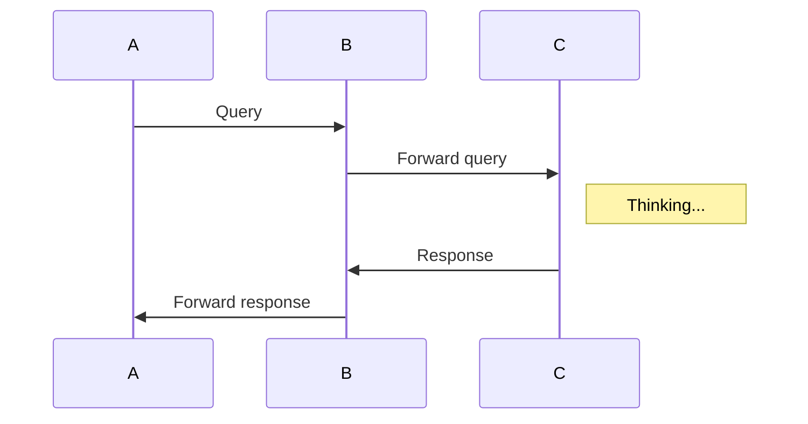

# sequence-diagrams
A simple chrome extension to add support for mermaid blocks in github pages

For example add this to any wiki page or markdown file in github

This will generate a nice diagram using the mermaid library